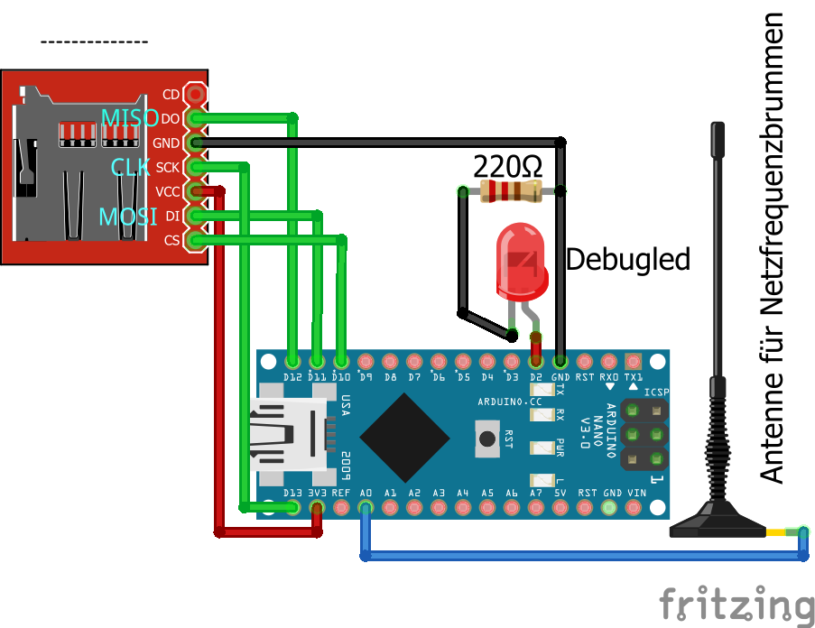
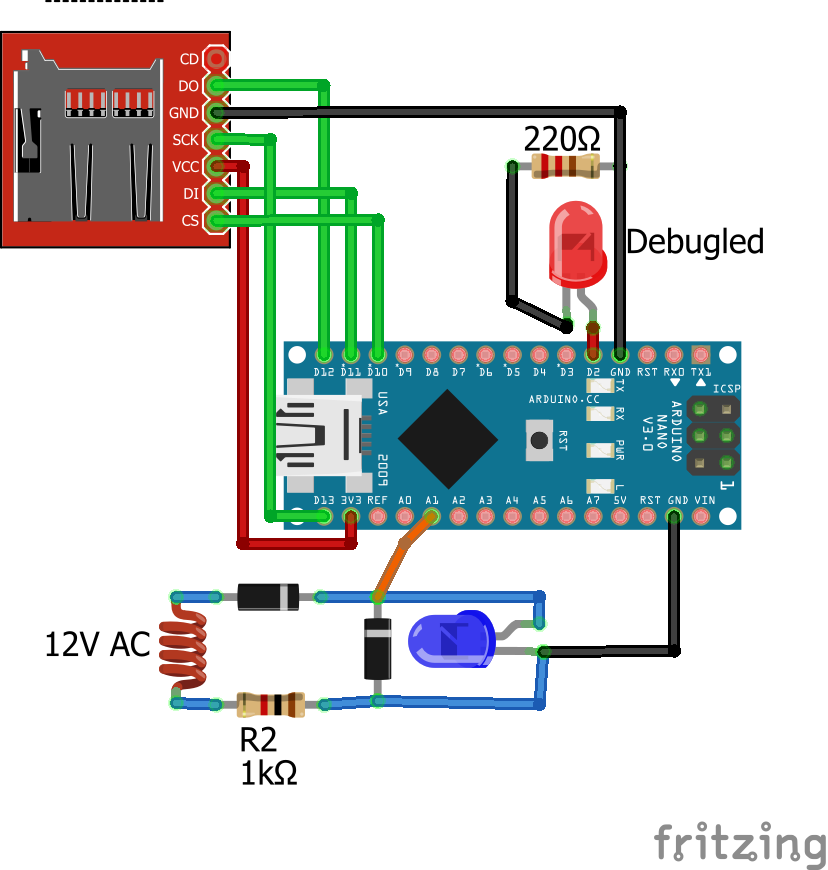

# Bestimmung der Netzfrequenz mittels Arduino

Dies ist eine bearbeitete Version von https://github.com/ratopi/netzfrequenz

Neue Funtionen:
- Möglichkeit zum Aufzeichen von Daten auf eine SD Karte 
- Debug LED, sodass auch ohne Seriellen Monitor erkannt werden kann, ob die SD Karte korrekt erkannt wird (leuchtet dauerhaft bei Fehler)
- Minimum/Maximum Grenze, damit offensichtich falsche Werte nicht aufgezeichnet werden
- Aktive Messung (siehe weiter unten)

Die SD Karten Steuerung wurde inspiriert von dem Artikel "Guide to SD Card Module with Arduino" gefunden auf der Seite randomnerdtutorials.com (https://randomnerdtutorials.com/guide-to-sd-card-module-with-arduino/).

--- Orginaltext ---

Dieser kleine Sketch zeigt wie man mittels einer einfachen kurzen Antenne
an einem Analog-Port des Arduinos die aktuelle Netzfrequenz des Stromnetzes
messen kann.

Die Messung der Netzfrequenz kann interessant sein um zu beobachten, ob momentan genug
oder zu wenig Strom ins Netz eingespeist wird.
Wird zu wenig Strom eingespeist, so sinkt die Netzfrequenz.
Wird zu viel Strom eingespeist, so steigt die Netzfrequenz.

# Passive Messung
An Port A0 wird einfach ein kurzes Stück Draht (beispielsweise 10cm) angeschlossen.
Das andere Ende des Drahtes wird offen gelassen, so fungiert der Draht als Antenne und 
Port A0 "empfängt" dann ein verrauschtes Netzbrummen.

Im Programm wird der zeitliche Abstand der Minmumdurchgänge dieses Brummen gemessen, was
der Periodendauer entspricht.
Aus dem Kehrwert der Periodendauer ergibt sich dann die Frequenz.

Um die Sache etwas genauer zu machen wird die Zeit für 50 Perioden gemessen und dann
gemittelt.
### Schaltungsaufbau

# Aktive Messung
Quelle: https://mnuino.i-networx.de/SN0002/netzfreq.html

> Der "Sensor" besteht im Fall 3. aus einem "alten" Steckernetzteil oder Handy-Ladegerät für 4 bis 12 Volt mit richtigem Transformator, erkennbar am relativ hohen Gewicht. Die Leistung spielt dabei überhaupt keine Rolle. Das Netzteil sollte keinen Gleichrichter haben, und wenn, dann nur einen Einweggleichrichter, und auf keinen Fall einen Kondensator.
(Die modernen Ladegeräte zeichnen sich dadurch aus, daß sie ein viel leichteres Schaltnetzteil haben, das für unsere Zwecke jedoch leider völlig ungeeignet ist.)
Ein bißchen zusätzliche Hardware brauchen wir aber doch noch. Das entscheidende Bauteil ist eine weiße oder blaue LED, die die abgegebene Spannung zuverlässig auf 3 Volt begrenzt. (Die LED wirkt gewissermaßen wie eine Zenerdiode.)
Alternativ kann man natürlich zwei rote oder gelbe LEDs hintereinander schalten.
Die in Gegenrichtung geschaltete Diode sorgt dafür, daß die Spannung am Eingang des Arduino nie negativer wird als -0,2 Volt.
Sicherheithinweis:

>**!!! Beachten Sie, daß jegliche Berührung von Teilen, die Netzspannung führen, mit absoluter Sicherheit verhindert werden muß.
Optimal sind Netzteile, die vollständig gekapselt sind.**

### Schaltungsaufbau

 

# Kalibrierung
Vorgehen:
1. Programm mit Korrekturwert = 1 auf Arduino flashen und gemessene Werte mit denen von http://www.netzfrequenzmessung.de/ vergleichen.
2. Rechnen: `KORREKTUR = realer_wert / gemessener_Wert `
3. Korrekturwert (mit mindestens 8 Nachkommastellen) im Quellcode eintragen und hochladen
verglichen werden.

 
Viel Spaß

ratopi,      dustinbrun